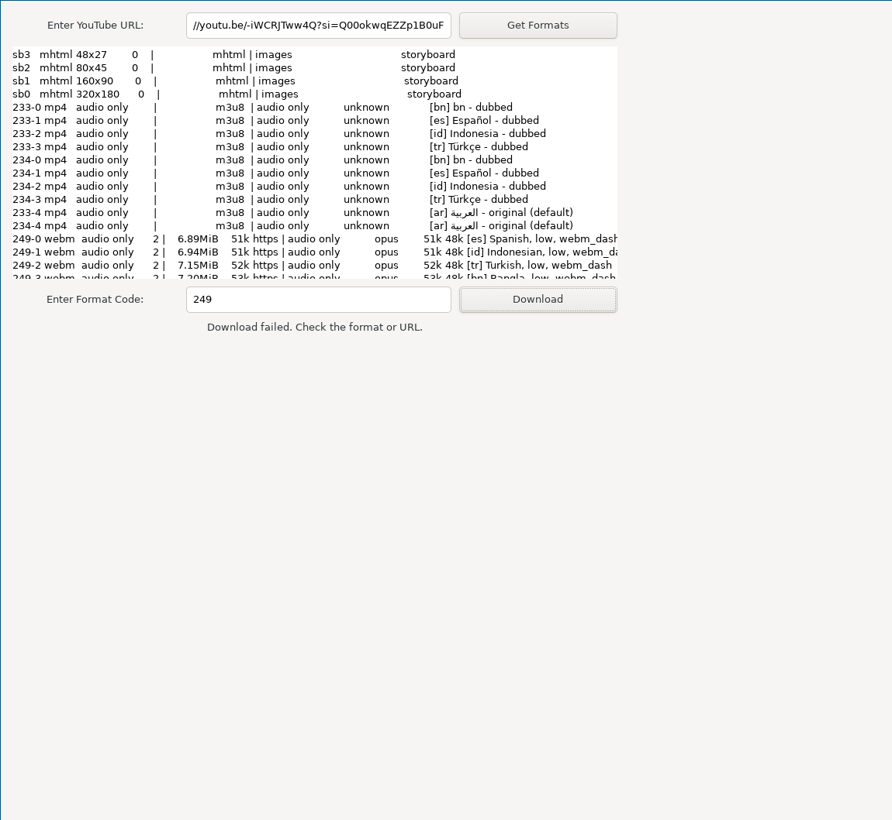
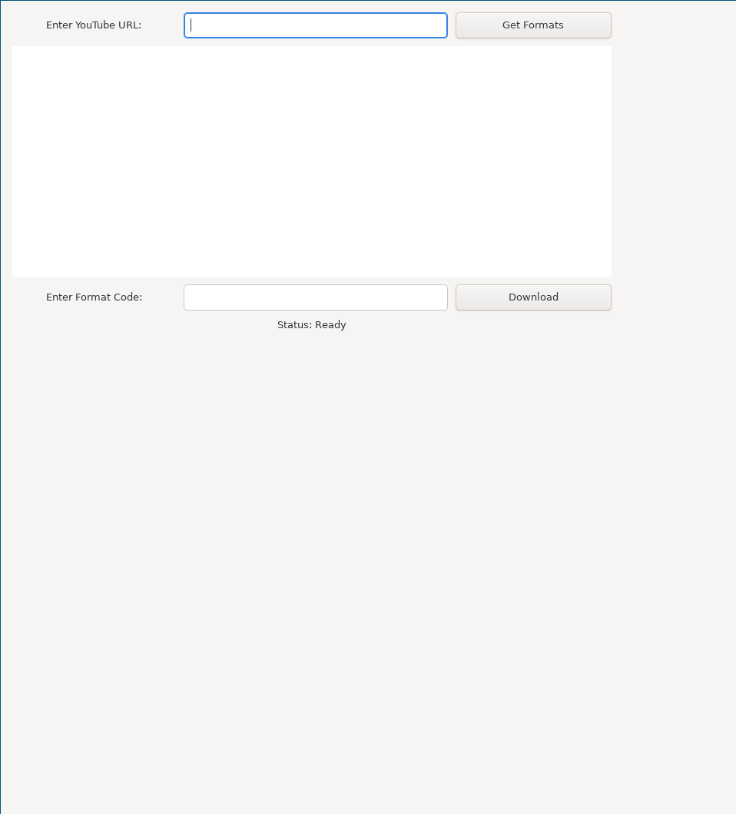

# YouTube Downloader Application

This README provides comprehensive instructions for setting up and using the YouTube Downloader application built with GTK and `yt-dlp`. The application allows users to fetch available formats for YouTube videos and download videos in a chosen format.



---

## Features

- Fetch available formats for a YouTube video using `yt-dlp`.
- Download YouTube videos by specifying the format code.
- User-friendly GTK-based graphical interface.

---

## Prerequisites

Before running the application, ensure the following requirements are met:

1. **GTK Development Libraries**:
    
    - GTK 3.x development libraries are required to compile the application.
    - Install `libgtk-3-dev` (or equivalent) for your Linux distribution.
2. **yt-dlp**:
    
    - Ensure `yt-dlp` is installed. It can be installed via pip or your package manager.
3. **Compiler**:
    
    - GCC or any C compiler supporting GTK development.
4. **Other Utilities**:
    
    - `make` and `pkg-config` must be installed.

---

## Installation Steps

### Step 1: Install Dependencies

Run the appropriate command below to install the required dependencies for your Linux distribution:

#### Debian/Ubuntu

```bash
sudo apt update
sudo apt install -y libgtk-3-dev gcc make pkg-config python3-pip
pip3 install yt-dlp
```

#### Fedora/RHEL/CentOS

```bash
sudo dnf install -y gtk3-devel gcc make pkg-config python3-pip
pip3 install yt-dlp
```


#### Arch Linux

```bash
sudo pacman -Syu --needed gtk3 gcc make pkgconf python-pip
pip install yt-dlp
```

#### Void Linux

```bash
sudo xbps-install -Sy gtk+3-devel gcc make pkg-config python3-pip
pip install yt-dlp
```

### Step 2: Compile the Application

Clone the repository or copy the source code, then compile it:

```bash
gcc -o yt_downloader yt_downloader.c $(pkg-config --cflags --libs gtk+-3.0)
```

This will create an executable named `yt_downloader` in the current directory.

---

## Running the Application

1. **Start the Application**:
    
    ```bash
    ./yt_downloader
    ```
    
2. **Using the Application**:
    
    - **Fetch Formats**: Enter a valid YouTube video URL in the input field and click the **Get Formats** button. The available formats will be displayed in the text view.
    - **Download Video**: Enter the format code in the format input field and click the **Download** button. The video will be downloaded to the `downloads` folder in the current directory.
3. **Status Updates**:
    
    - The status label will display progress or errors encountered during execution.

---

## Making the Application a System-wide Tool

To make the application accessible from anywhere:

### Step 1: Move Executable to a System Directory

```bash
sudo mv yt_downloader /usr/local/bin/
```

### Step 2: Create a Desktop Entry

Create a `.desktop` file to integrate the application with your desktop environment:

```bash
sudo tee /usr/share/applications/yt_downloader.desktop <<EOF
[Desktop Entry]
Name=YouTube Downloader
Comment=Download YouTube videos with a GUI
Exec=/usr/local/bin/yt_downloader
Icon=utilities-terminal
Terminal=false
Type=Application
Categories=Network;Utility;
EOF
```

### Step 3: Update Desktop Entries

```bash
update-desktop-database
```

You can now launch the application from your desktop menu or app launcher.

---

## Additional Notes

### Error Handling

- If a command fails, the status label in the application will provide details about the error.
- Ensure that `yt-dlp` is correctly installed and accessible in the system's PATH.

### Customization

- Modify the `downloads` directory in the source code to change the default download location.

---

## Troubleshooting

1. **Missing Dependencies**: Ensure all required libraries are installed. Refer to the installation steps for your distribution.
    
2. **yt-dlp Not Found**: Ensure `yt-dlp` is installed and accessible via the `PATH` environment variable.
    
3. **Permission Issues**: Run the application with the necessary permissions if encountering issues related to file writing.
    

---

## License

This application is licensed under the MIT License.

---
